# Welcome to Sushi-Lover!
#### This project was created for final exam of the course "Python Web Framework" at SoftUni

# 
 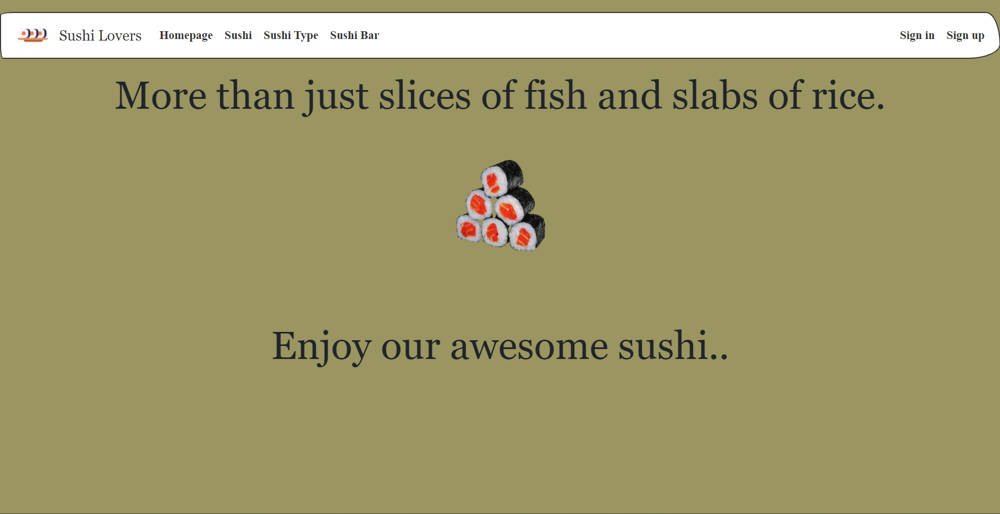 

### Abstract

This web application is designed for all sushi lovers. For those who want to collect and share their favorite types of
sushi and sushi bars.

### Table of Contents

* [1. Introduction](#chapter_1)
* [2. Website Overview](#chapter_2)
    * [2.1. Users and Profiles](#section_2_1)
        * [2.1.1. Anonymous User](#section_2_1_1)
        * [2.1.2. Registered User](#section_2_1_2)
        * [2.1.3. Greetings Email](#section_2_1_3)
        * [2.1.4. Administrative User](#section_2_1_4)
        * [2.1.5. Profile Characteristics](#section_2_1_5)
    * [2.2. Sushi](#section_2_2)
        * [2.2.1. Sushi Characteristics](#section_2_2_1)
        * [2.2.2. Sushi Likes](#section_2_2_2)
        * [2.2.3. Sushi Comments](#section_2_2_3)
    * [2.3. Sushi Types](#section_2_3)
        * [2.3.1. Sushi Type Characteristics](#section_2_3_1)
        * [2.3.2. Sushi Type Likes](#section_2_3_2)
        * [2.3.3. Sushi Type Comments](#section_2_3_3)
    * [2.4. Sushi Bars](#section_2_4)
        * [2.4.1. Sushi Bar Characteristics](#section_2_4_1)
        * [2.4.2. Sushi Bar Likes](#section_2_4_2)
        * [2.4.3. Sushi Bar Comments](#section_2_4_3)
* [3. Mandatory requirements](#chapter_3)
* [4. Tests Coverage](#chapter_4)
* [5. Additional Developments](#chapter_5)

### 1. Introduction 

Website users have the opportunity to create their own accounts and publish their favorite sushi, sushi types, and
sushi bars. Each post can be liked and commented on by other users. Each user collects their own posts and likes from other
users.

### 2. Website Overview 

Both registered and unregistered users have access to the website.

Unregistered users have the opportunity to view only the posts of registered users, and they cannot like or comment on
the posts.

Registered users have the opportunity to create their own profiles and make posts. They can also put a comment below
their own posts, but can't say they like it.

In the following described in detail the functionality of the objects.

#### 2.1. Users and Profiles 

A ***Custom User Model*** has been implemented to create a user objects so that the email address can be used as the
primary user ID instead of the authentication username.

The user objects have relational connections to all other objects in the project.

In terms of registration, users are:

- Anonymous User
- Registered users
- Administrative users

The accounts (profiles) objects have a relational connection "OnetoOne" with pre-created users.

##### 2.1.1 Anonymous User 

The ***anonymous user*** has permission to view only all public post and their details. This user has restricted access
to the navigation bar. He is able to register in the website with an email and password. The registration includes an
email verification process. Once this user has registered and logged in to the website he has access to the rest of the
functionality.

# 
 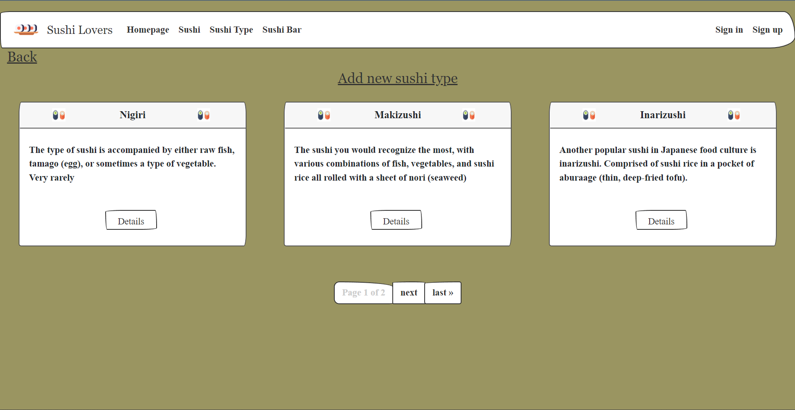 

##### 2.1.2 Registered User 

The ***registered user*** is already registered and can log in with an email and password. After his authentication, the
user is able to navigate through the navigation bar. The registered user has his own profile with a username, image,
first name, last name, and age. This user has all CRUD permissions to his own posts. He can like
and comment on all public posts in the system.

# 
 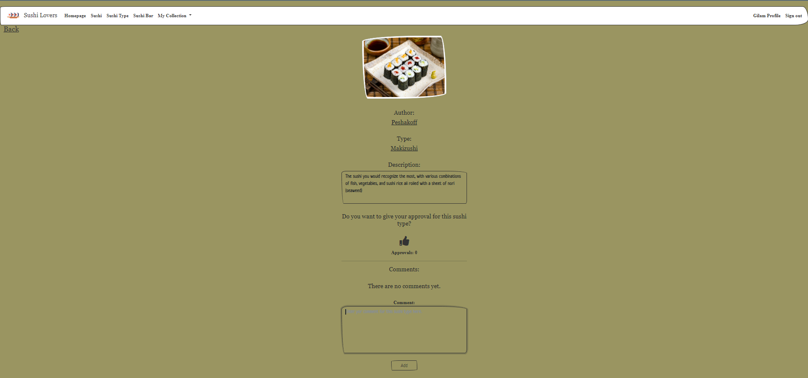 

##### 2.1.3 Greetings Email 

The ***greetings email*** function is a feature that allows registered users to receive a personalized greeting email upon signing up for the website. The email includes a message welcoming the user to the website and uses the user's email address as the name in the greeting. The greeting email is sent automatically upon successful registration and is sent using MailCatcher.

# 
 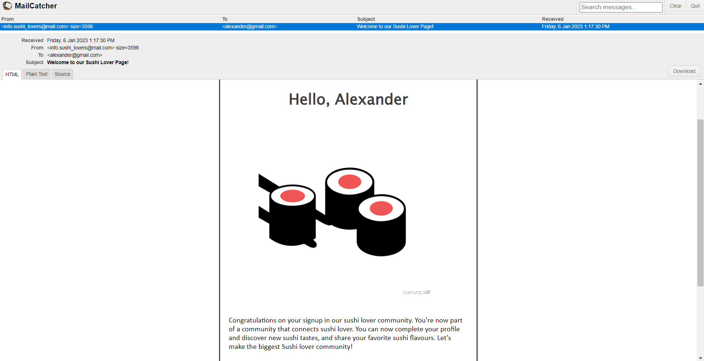 

##### 2.1.4 Administrative User 

The ***administrative user*** gets enabled through the admin site by the superuser. His 'is_staff' field is set to True.
This user has all CRUD permissions over other users and their posts in the database.

# 
 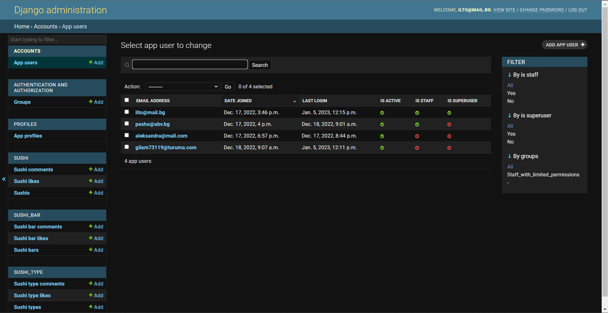 

##### 2.1.5 Profile Characteristics 

Every registered user has an account ***(profile)***. The profile allows the user to update his
own information and to delete his own account. The profile page shows the completion of the user's profile and his
collections. The ***profile*** can be completed up to 100% after all fields in the form are filled out.

The ***profile*** has the following fields:

- username - CharField with min length 2 chars and max length 15 chars
- first_name - CharField with min length 2 chars and max length 15 chars
- last_name - CharField with min length 2 chars and max length 15 chars
- age - PositiveIntegerField with min value 16
- image - ImageField

# 
 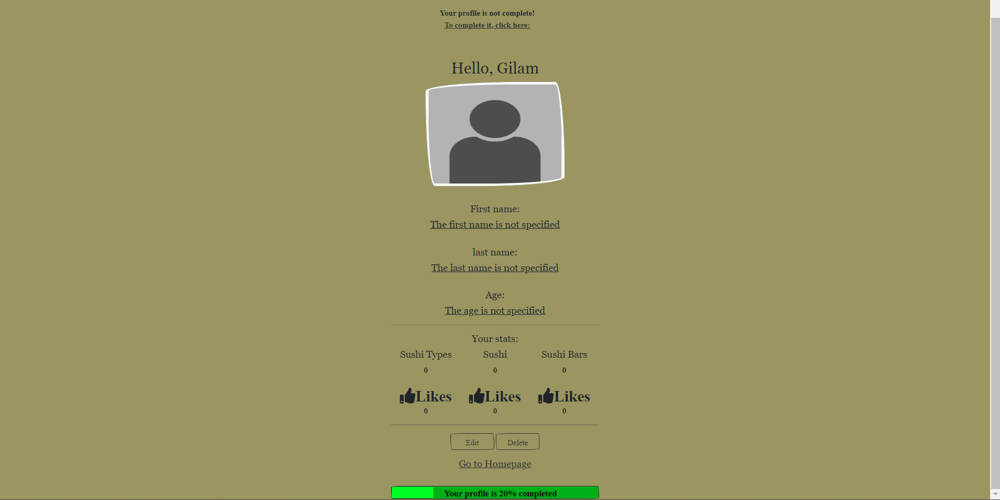 

#### 2.2. Sushi 

The ***sushi*** could be either public or private. It can be viewed by all types of users but created, edited, and
deleted only by its author. The author can put comments but can't like his own sushi. Only the other users can like
it.

##### 2.2.1 Sushi Characteristics 

The ***sushi*** has the following fields:

- label - CharField with max length 20 chars
- type - ForeignKey relation with sushi type
- ingredients - TextField with max length 150 chars
- image - ImageField
- user - ForeignKey relation with user

# 
 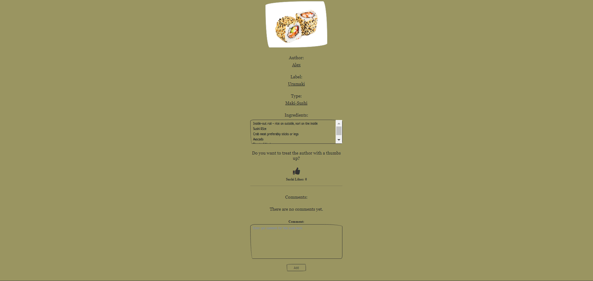 

##### 2.2.2 Sushi Likes 

The ***sushi like*** could be either public or private. It can be viewed by all types of users. The author and
anonymous users can't like the ***sushi***. Only the other users can like it. Once the like object is created by a
single user, it can be only deleted when clicked again.

The ***sushi like*** has the following fields:

- sushi - ForeignKey relation with sushi
- user - ForeignKey relation with user

# 
  

##### 2.2.3 Sushi Comments 

The ***sushi comment*** could be either public or private. It can be viewed by all types of users. The anonymous
users can't comment on the ***sushi***, only the other users can.

The ***sushi comment*** has the following fields:

- comment - TextField with min length 5 chars and max length 180 chars
- sushi - ForeignKey relation with sushi
- user - ForeignKey relation with user

# 
 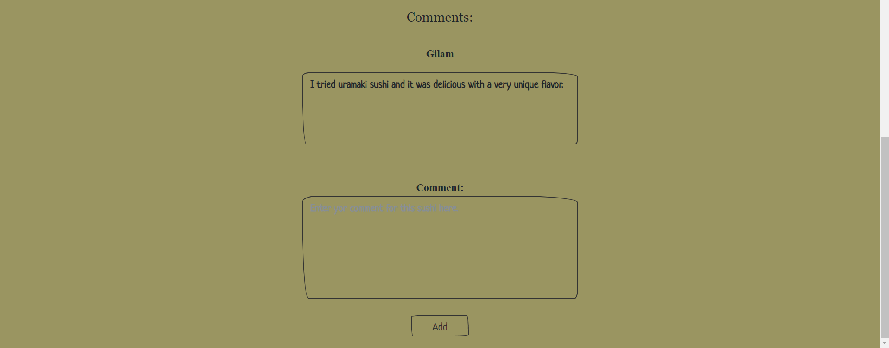 

#### 2.3. Sushi Types 

The ***sushi type*** could be either public or private. It can be viewed by all types of users but created, edited, and
deleted only by its author. The author can put comments but can't like his own ***sushi type***. Only the other users
can like it.

##### 2.3.1 Sushi Type Characteristics 

The ***sushi type*** has the following fields:

- name - CharField with max length 20 chars
- description - TextField with max length 150 chars
- image - ImageField
- user - ForeignKey relation with user

# 
  

##### 2.3.2 Sushi Type Likes 

The ***sushi type like*** could be either public or private. It can be viewed by all types of users. The author and
anonymous users can't like the ***sushi type***. Only the other users can like it. Once the like object is created by a
single user, it can be only deleted when clicked again.

The ***sushi type like*** has the following fields:

- sushi_type - ForeignKey relation with sushi type
- user - ForeignKey relation with user

# 
  

##### 2.3.3 Sushi Type Comments 

The ***sushi type comment*** could be either public or private. It can be viewed by all types of users. The anonymous
users can't comment on the ***sushi type***, only the other users can.

The ***sushi type comment*** has the following fields:

- comment - TextField with min length 5 chars and max length 180 chars
- sushi_type - ForeignKey relation with sushi type
- user - ForeignKey relation with user

# 
  

#### 2.4. Sushi Bars 

The ***sushi bar*** could be either public or private. It can be viewed by all types of users but created, edited, and deleted
only by its author. The author can put comments but can't like his own ***sushi bar***. Only the other users can like it.

##### 2.4.1 Sushi Bar Characteristics 

The ***sushi bar*** has the following fields:

- name - CharField with max length 20 chars
- address - TextField with max length 60 chars
- description - TextField with max length 150 chars
- website - URLField
- image - ImageField
- longitude - DecimalField with max digits 9, decimal places 6
- latitude - DecimalField with max digits 9, decimal places 6
- user - ForeignKey relation with user

# 
 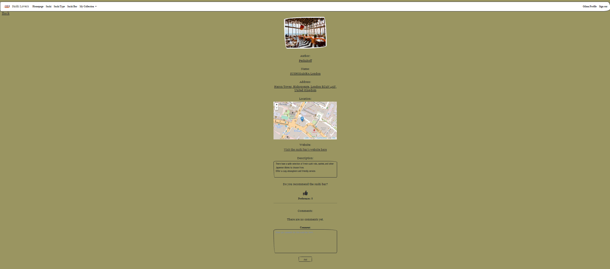 

##### 2.4.2 Sushi Bar Likes 

The ***sushi bar like*** could be either public or private. It can be viewed by all types of users. The author and anonymous
users can't like the ***sushi bar***. Only the other users can like it. Once the like object is created by a single user, it
can be only deleted when clicked again.

The ***sushi bar like*** has the following fields:

- sushi_bar - ForeignKey relation with sushi bar
- user - ForeignKey relation with user

# 
  

##### 2.4.3 Sushi Bar Comments 

The ***sushi bar comment*** could be either public or private. It can be viewed by all types of users. The anonymous users
can't comment on the ***sushi bar***, only the other users can.

The ***sushi bar comment*** has the following fields:

- comment - TextField with min length 5 chars and max length 180 chars
- sushi_bar - ForeignKey relation with sushi bar
- user - ForeignKey relation with user

# 
 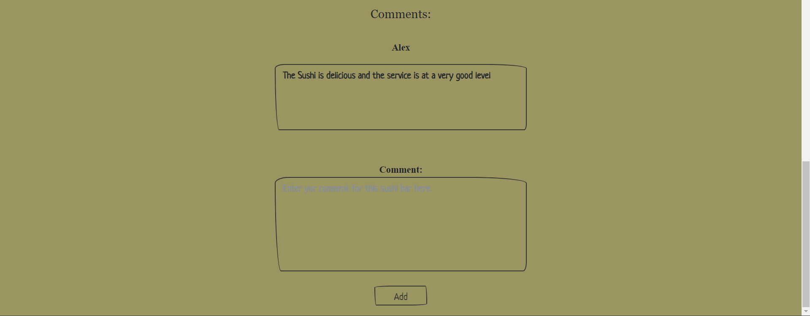 

### 3. Mandatory requirements 

- [x] The application must be implemented using Django Framework
- [x] The application must have at least 10 web pages(Can be created using function-based views or/and class based-views and At least 5 of them must be class-based views.)
- [x] The application must have at least 5 forms.
- [x] The application must have at least 5 templates.
- [x] The application must have at least 5 independent models(models created by extending, inheritance, and one-to-one relation is considered one model).
- [x] The application must have login/register functionality
- [x] The application must have public part (A part of the website, which is accessible by everyone – un/authenticated
  users and admins)
- [x] The application must have private part (accessible only by authenticated user and admins)
- [x] The application must have admin part (accessible only to admins)
- [x] Unauthenticated users (public part) have only 'get' permissions e.g., landing page, details, about page
- [x] Authenticated users (private part) have full CRUD for all their created content
- [x] Admins have full CRUD functionalities
- [x] Form validations
- [x] To avoid crashes, implement Error Handling and Data Validations
- [x] Use PostgreSQL as a database.
- [x] Templates (your controllers/views must return HTML files) – one and the same template could be re-used/used
  multiple times (with the according adjustments, if such needed)
- [x] Use a source control system by choice – Github or Gitlab. You must have at least 5 commits + README

### 4. Tests Coverage 

#### Account tests

# 
 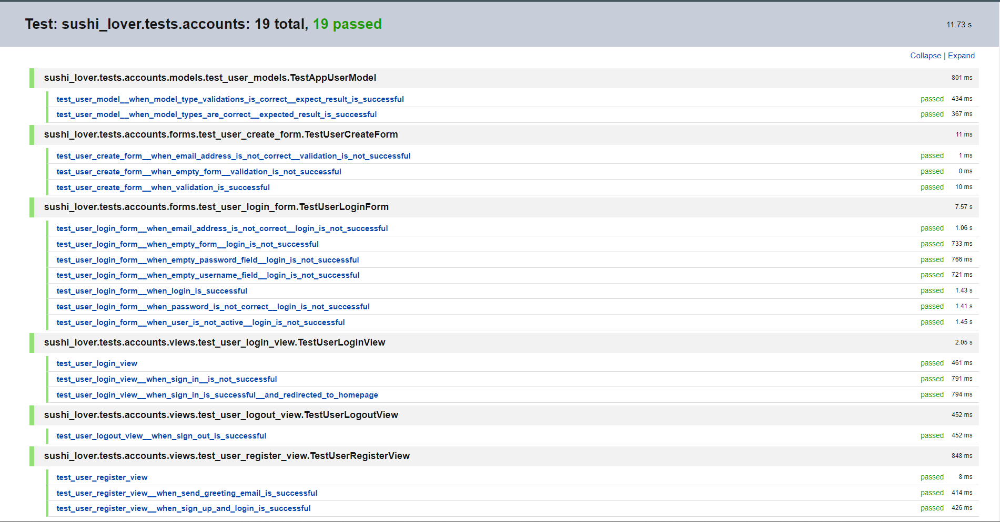 

#### Sushi tests

# 
 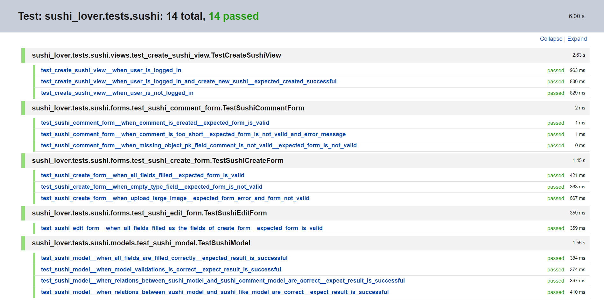 

### 5. Additional Developments 

- [x] Responsive web design
- [x] Class-based views
- [x] Extended Django user
- [x] Write tests (Unit & Integration) for your views/models/forms - at least 10 tests
- [ ] Writing asynchronous view/s somewhere in the project
- [ ] Extend your Django project with REST Capabilities
- [ ] Host the application in a cloud environment
- [ ] Additional functionality, not explicitly described in this section, will be counted as a bonus if it has practical usage

